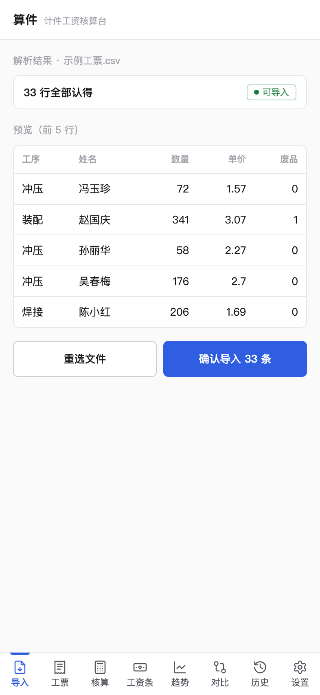
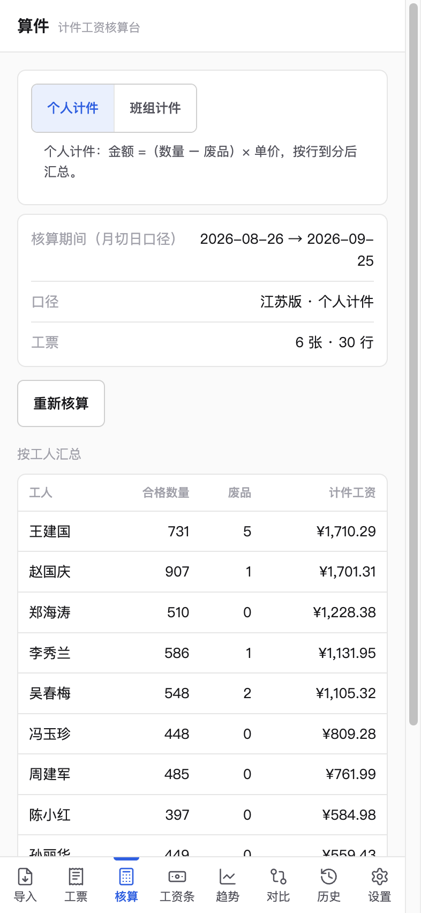
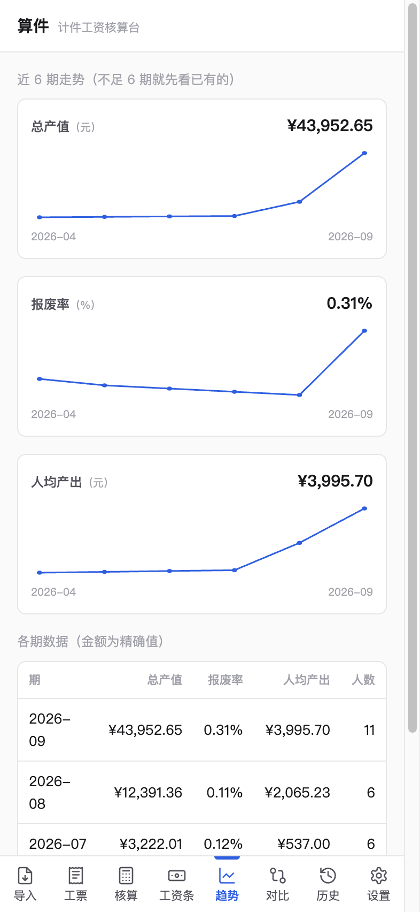

# 算件 SuanJian · 计件工资 AI 核算台

> 给还没上 ERP 的小厂：拍照/导入计件工票 → AI 预提取 → 人工确认 → 确定性引擎出工资条。
> 一人 + AI 协作流水线作品（制造业 × AI）。**净室声明：不含任何前雇主代码、表单样式与数据，规则为领域理解重写。**

## 界面（手机三屏）

<p align="center">
  <a href="docs/images/mobile-import.png"></a>
  <a href="docs/images/mobile-calc.png"></a>
  <a href="docs/images/mobile-trend.png"></a>
</p>
<p align="center"><sub>左：导入页（示例 CSV 解析预览） · 中：核算页（确定性引擎结果） · 右：趋势页（近 6 期报表）</sub></p>

## Overview (English)

SuanJian is an offline-first piece-rate payroll calculator for small factories that haven't adopted ERP. Paper work tickets are imported as CSV or photographed; an optional BYOK AI pre-fills the structured form for a human to confirm, while a fully deterministic `Decimal` engine computes the payslips — AI never touches the money math, so every payroll run is reproducible and auditable. The whole app is a single Python 3 standard-library server plus SQLite (WAL): zero dependencies, runs entirely offline, and ships with 350+ tests including 2000-round randomized allocation invariant checks.

## 为什么是它

小厂计件工资的三笔糊涂账：手抄工票错漏、报废没人对账、月切日跨期算不清。
算件把「算钱」做成确定性引擎（可复算、可审计），把「录单」交给 AI 预填+人工确认——
**AI 只碰输入端，碰钱的一行代码都没有。**

## 亮点

- **确定性核算引擎**：全链 `Decimal` + 银行家舍入；班组分摊尾差挂「调整」行，
  2000 轮随机分摊不变量测试（Σ分摊 ≡ 总额恒成立）
- **报废对账**：应产 / 实报 / 报废 / 下落不明 四列恒等式，精确对平
- **月切日**：上月 26 日 → 本月 25 日的计件周期，跨年/闰年边界全覆盖
- **拍照识别（主打）**：手写工票 → AI 结构化预填 → 人工确认。
  合成样张字段级实测 **115/115 = 100%**（含抖动+噪点+旋转最高难度档）
- **工资条导出**：一键导出当期全员工资条 Excel（汇总 + 明细两个 sheet，
  金额精确字符串，Excel/WPS 直接打开）
- **多月趋势**：近 6 期总产值 / 报废率 / 人均产出线条报表（按月切日归期聚合）
- **零依赖**：python3 标准库 HTTP + SQLite WAL，桌面单机，离线可跑
- **安全**：构造层拒绝 bool/NaN/Infinity 混入金额；float 禁入；AST 静态测试锁死引擎纯函数

## 口径声明（诚实条款）

- 工资规则为**江苏版演示基准**，上海版未覆盖
- 个税为**演示用月度速算表**（非累计预扣法），不可用于真实报税
- 班组尾差归属：挂数量最大成员（演示口径）
- 识别精度为**合成样张实测**，真实手写工票待真机验证

## 快速开始

```bash
python3 server.py            # 打开 http://127.0.0.1:8770
python3 -m pytest tests/ -q  # 全量测试
```

## 部署

算件是桌面单机工具（默认只绑定 127.0.0.1，本机访问），两种部署方式：

**方式一：python3 裸跑（推荐，零安装）**

```bash
python3 server.py                      # 默认 http://127.0.0.1:8770
SUANJIAN_PORT=9000 python3 server.py   # 环境变量改端口
python3 server.py 9000                 # 或第一个参数传端口
```

运行零依赖（python3 标准库），换电脑只需拷整个目录。

**给手机用（局域网模式 + 口令门）**

```bash
SUANJIAN_LAN=1 python3 server.py       # 绑 0.0.0.0，同一 Wi-Fi 的手机可访问
```

- 启动后会打印手机可打开的网址（如 `http://192.168.x.x:8770/`）
- 强烈建议同时设口令：在 `data/config.json` 写 `{"code": "六位以上口令"}`
  ——设了之后所有数据接口要口令（浏览器会弹口令输入页，输对一次本会话不再问；
  口令支持中文，前端会自动做安全编码传输）；
  不设则同网任何设备都能直接看到数据（启动日志会提醒）
- 改口令不用重启服务；口令只存本机会话，不会发给任何第三方

**方式二：打包单文件可执行（发给没装 python3 的电脑）**

```bash
bash tools/build_exe.command   # 产出 dist/suanjian 单文件可执行
```

- 打包配置见 `suanjian.spec`；产物同样支持 `SUANJIAN_PORT` 改端口
- Windows 的 .exe 必须在 Windows 电脑上跑同一脚本生成（PyInstaller 不跨系统打包，macOS 只能出 macOS 包）

## 数据与备份

- 业务数据与日志都落在 `data/`；导入的工票 CSV 建议放项目根目录或 `imports/`
- 备份：`bash tools/backup.command` —— 把 `data/`（SQLite 走在线一致性快照）与 CSV 压成
  `backups/suanjian-时间戳.tar.gz`，自动清理 14 天前的旧备份
- 备份不含密钥：`data/config.json`（口令 + 识别服务密钥）不进备份文件——界面下载与
  命令行备份都已排除，密钥请单独保管
- 恢复：先停掉算件，再 `tar -xzf backups/suanjian-xxxx.tar.gz -C .` 覆盖 `data/`

## 架构

```
web/            单页前端（原生 JS，手机优先）
server.py       标准库 HTTP + 静态服务（realpath 防穿越）
core/engine.py  计件核算引擎（纯函数零 IO，AST 测试锁定）
core/ocr_pipe.py  拍照识别管线（AI 预填 → 人工确认，BYOK 可选）
core/db.py      SQLite WAL + 审计留痕
```

## 面试演示（90 秒）

见 [docs/面试演示脚本.md](docs/面试演示脚本.md)
